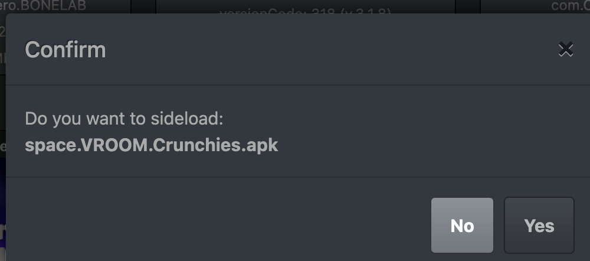
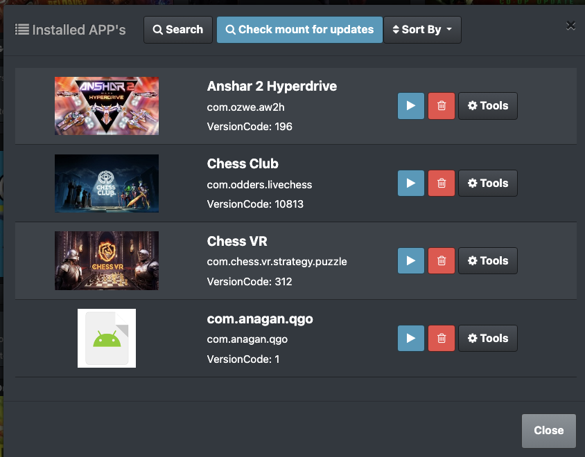
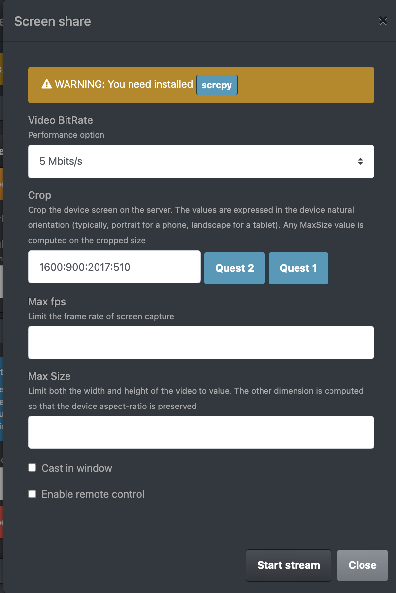
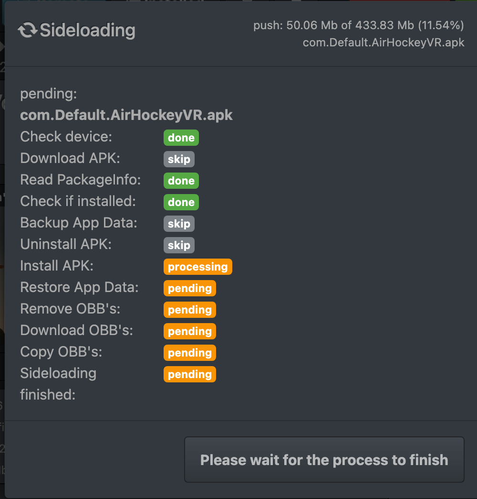
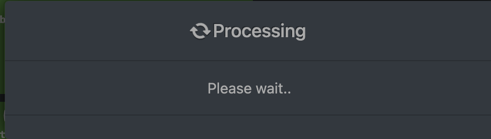
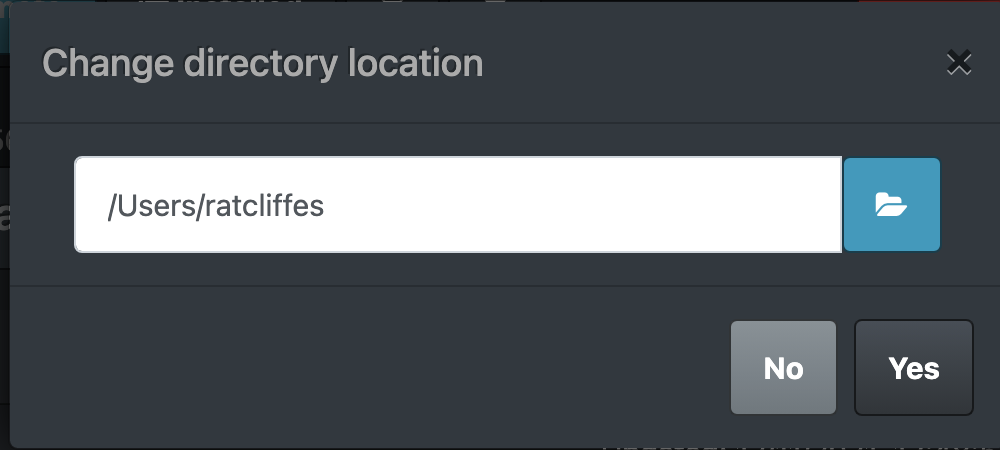

# Listeners By Component

## Pages

### System Check (index)

- check_deps

### File Browser Page

- folder_install
- reset_cache
- get_dir
- change_config
- app_info

## Settings Page / Modal

- change_config

## Modals

### App Info modal

- dev_open_url
- app_info
- app_events_info

### App Info Events

### App Tools modal

- app_config_set
- app_tools
- app_backup
- data_backup
- data_restore

### App start modal (unimplemented)

- get_activities
- start_activity

### Confirm modal

- start_sideload

### Device Tweaks modal

- enable_mtp
- reboot_device
- reboot_recovery
- reboot_bootloader
- sideload_update
- device_tweaks
- change_config

### Installed modal

- get_installed
- get_installed_with_updates
- folder_install
- uninstall
- start_app
- change_config
- app_tools

### Scrcpy modal

- scrcpy_start
- change_config

### Sideload modal

- start_sideload

### Sideload Queue modal

- start_sideload

## Blocks

### Device Info block

- get_device_info

### Device Buttons block

- connect_wireless
- disconnect_wireless
- mount
- check_mount

## Misc

### Error Page

### Donate

### Processing

### Prompt

### Renderer window

- filedrop
